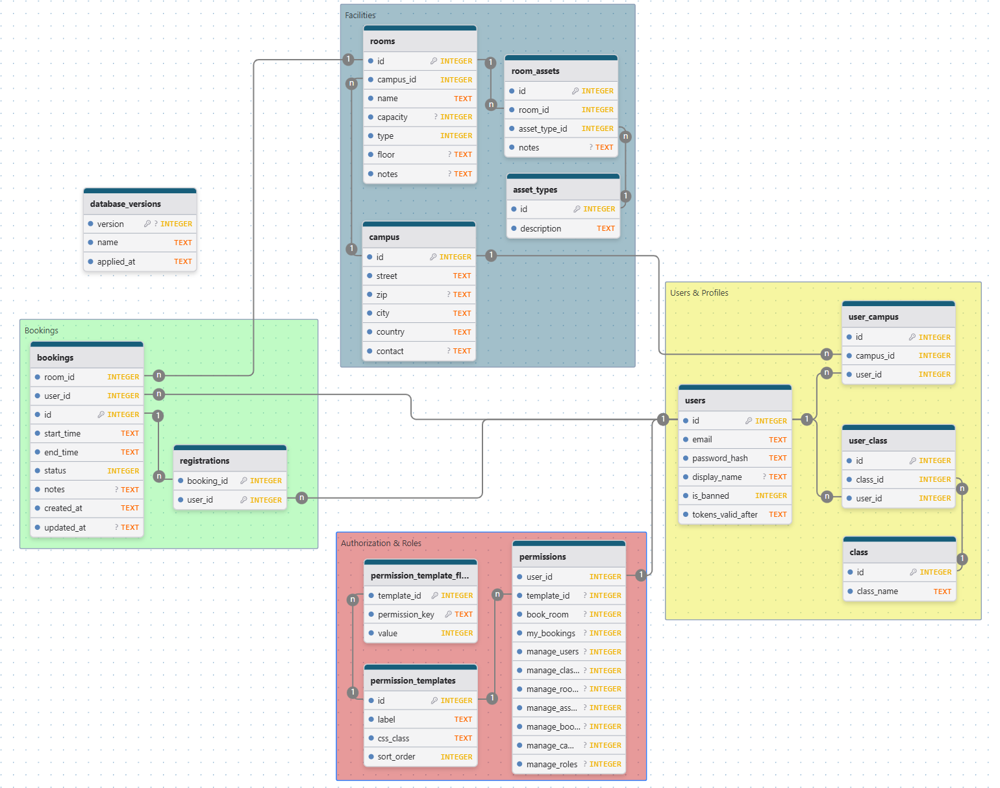

### **1. Auth & Identity**

- **One User** has **One Role Level** (Student, Educator, or Admin).
- **Security Strategy:** - **Passwords** are manually hashed using a unique `password_salt` for each user.
- **Sessions** are stateless using JWTs. Global logout (revocation) is handled by the `tokens_valid_after` timestamp. Any JWT issued before this timestamp is considered invalid.

### **2. Rooms & Equipment**

- **One Room** contains **Many Assets** (physical items inside).
- **One Asset Type** (e.g., "Projektor") defines **Many Assets** (many copies exist in different rooms).
- _Note: An "Asset" connects a specific Room to a specific Asset Type._

### **3. Bookings & Participants**

- **One Room** hosts **Many Bookings** (scheduled at different times).
- **One User** (Host) organizes **Many Bookings**.
- **One Booking** has **Many Registrations** (a list of participants).
- **One User** holds **Many Registrations** (tickets for different events).

## **Technical Note on Dates**

**SQLite does not have a native `DATETIME` type.**

- **Storage:** Even though our schema uses `DATETIME`, SQLite actually stores these values as **TEXT** strings.
- **Format:** We strictly use the **ISO-8601** format: `"YYYY-MM-DD HH:MM:SS"`.
- **Why:** This specific string format is "lexicographically sortable" (meaning "2026..." correctly sorts after "2025...").
- **Developer Rule:** Always save dates as `DateTime.UtcNow` in C# to ensure the format remains consistent and sortable.

## SQL Schema

```sql

```
