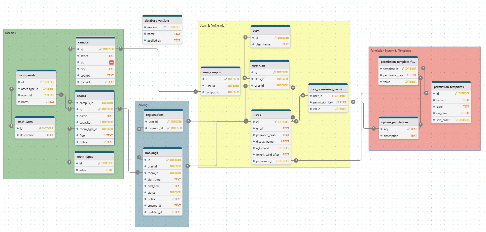

Link to diagram: [www.drawdb.app](https://www.drawdb.app/editor?shareId=72fdc3d4c7d38eea84083467078929c3)

### **1. Auth & Identity**

- **One User** belongs to **One Permission Template** (Role) OR acts as a **Custom User** (No Template).
- **Security Strategy:**
  - **Passwords** are hashed using **Argon2** (via `IPasswordHasher`).
  - **Sessions** are stateless using JWTs. Global logout (revocation) is handled by the `tokens_valid_after` timestamp. Any JWT issued before this timestamp is considered invalid.

### **2. Rooms & Equipment**

- **One Campus** contains **Many Rooms**. Rooms are linked to a campus via `campus_id` (rooms no longer have a direct `address` field).
- **One Room Type** categorizes **Many Rooms** via `room_type_id` (room types are a separate table, not an enum).
- **One Room** contains **Many Assets** (physical items inside).
- **One Asset Type** (e.g., "Projektor") defines **Many Assets** (many copies exist in different rooms).
- _Note: An "Asset" connects a specific Room to a specific Asset Type._

### **3. Bookings & Participants**

- **One Room** hosts **Many Bookings** (scheduled at different times).
- **One User** (Host) organizes **Many Bookings**.
- **One Booking** has **Many Registrations** (a list of participants).
- **One User** holds **Many Registrations** (tickets for different events).

## **Technical Note on Dates**

The project supports both **SQLite** and **PostgreSQL**. Date handling differs by provider:

### SQLite

- SQLite does not have a native `DATETIME` type. Values are stored as **TEXT** strings in **ISO-8601** format: `"YYYY-MM-DD HH:MM:SS"`.
- This format is "lexicographically sortable" (meaning "2026..." correctly sorts after "2025...").

### PostgreSQL

- PostgreSQL uses native `TIMESTAMPTZ` columns. Dates are stored with timezone awareness.

### Developer Rule

Always save dates as `DateTime.UtcNow` in C# to ensure consistency across both providers.

## SQL Schema

```sql
-- 1. System Permissions Registry
CREATE TABLE IF NOT EXISTS system_permissions (
    key TEXT PRIMARY KEY,
    description TEXT NOT NULL
);

-- 2. Permission Templates (Roles)
CREATE TABLE IF NOT EXISTS permission_templates (
    id INTEGER PRIMARY KEY AUTOINCREMENT,
    name TEXT NOT NULL UNIQUE,
    label TEXT NOT NULL,
    css_class TEXT,
    sort_order INTEGER DEFAULT 0
);

-- 3. Template Flags (Definition of what a Role can do)
CREATE TABLE IF NOT EXISTS permission_template_flags (
    template_id INTEGER NOT NULL,
    permission_key TEXT NOT NULL,
    value INTEGER NOT NULL DEFAULT 0, -- Boolean: 0 or 1
    PRIMARY KEY (template_id, permission_key),
    FOREIGN KEY (template_id) REFERENCES permission_templates(id) ON DELETE CASCADE,
    FOREIGN KEY (permission_key) REFERENCES system_permissions(key) ON DELETE CASCADE
);

-- 4. User Overrides (Granular exceptions)
CREATE TABLE IF NOT EXISTS user_permission_overrides (
    user_id INTEGER NOT NULL,
    permission_key TEXT NOT NULL,
    value INTEGER NOT NULL, -- Boolean: 0 or 1
    PRIMARY KEY (user_id, permission_key),
    FOREIGN KEY (user_id) REFERENCES users(id) ON DELETE CASCADE,
    FOREIGN KEY (permission_key) REFERENCES system_permissions(key) ON DELETE CASCADE
);

-- 5. Effective Permissions View
CREATE VIEW IF NOT EXISTS v_user_effective_permissions AS
SELECT
    u.id AS user_id,
    sp.key AS permission_key,
    COALESCE(upo.value, ptf.value, 0) AS is_granted
FROM users u
CROSS JOIN system_permissions sp
LEFT JOIN permission_templates pt ON u.permission_template_id = pt.id
LEFT JOIN permission_template_flags ptf ON pt.id = ptf.template_id AND ptf.permission_key = sp.key
LEFT JOIN user_permission_overrides upo ON u.id = upo.user_id AND upo.permission_key = sp.key;
```
