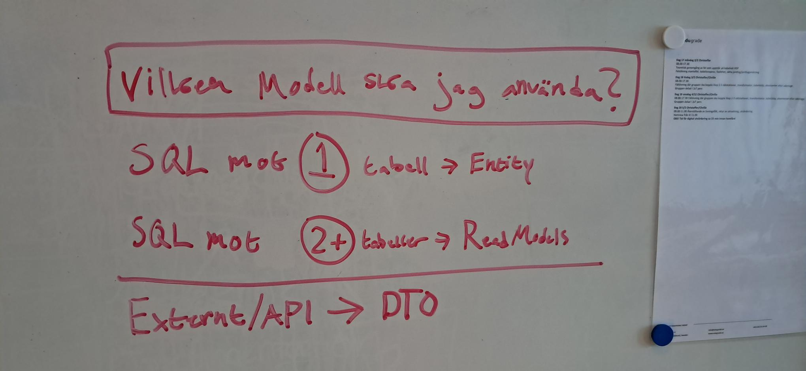

# 🏗️ Data Modeling & Query Guide

This document defines how we structure data objects and the specialized patterns we use for reading complex data.

## 1. The Unified Model Structure

All data-holding objects reside in `Backend/app/Core/Models/`.

```text
Backend/app/Core/Models/
├── Entities/       (Database tables: User.cs, Room.cs, Campus.cs, RoomType.cs)
├── DTO/            (API JSON: CreateRoomDto, RoomResponseDto, AuthDto)
├── Enums/          (Options: BookingStatus.cs, BannedStatus.cs, DbProviders.cs)
├── ReadModels/     (Complex SQL query results: RoomDetailModel, BookingSummary)
└── Projections/    (Flat auth representations: UserPermissions.cs)

```

### "Which Model do I use?"

| Model Type     | Simple Rule                                                                     | Example           |
| -------------- | ------------------------------------------------------------------------------- | ----------------- |
| **Entity**     | **Writing to DB.** Use for saving, updating, or deleting data.                  | `User`, `Room`    |
| **ReadModel**  | **Reading from DB.** Use for custom SQL queries (JOINs, aggregation).           | `RoomDetailModel` |
| **DTO**        | **Talking to Frontend.** Use for API inputs (Requests) and outputs (Responses). | `CreateRoomDto`   |
| **Enum**       | **Fixed Choices.** Use for statuses, types, or providers.                       | `BookingStatus`   |
| **Projection** | **Flat auth/middleware data.** Used by middleware to check access.              | `UserPermissions` |

## 2. Advanced Reads: The Read Model Pattern

In this project, we separate **Write Operations** (CRUD) from **Read Operations** (Queries) where beneficial. This is a lightweight implementation of the **CQRS (Command Query Responsibility Segregation)** pattern.

- **Standard Repositories:** Handle standard CRUD (Create, Read, Update, Delete) for single entities. They map directly to database tables.
- **Read Model (Query) Repositories:** Handle complex data retrieval. They are optimized for reading and often join multiple tables to return a "flat" or "shaped" view of the data that the UI needs.



### Standard vs. Read Model Repositories

| Feature          | Standard Repository (e.g., `SqliteRoomRepo`) | Read Model Repository (e.g., `SqliteRoomReadModelRepo`) |
| :--------------- | :------------------------------------------- | :------------------------------------------------------ |
| **Primary Goal** | Manage Entity State (Insert, Update, Delete) | Fetch Data for Display (Select)                         |
| **Return Type**  | Entities (`Room`, `User`)                    | Read Models (`RoomDetailModel`)                         |
| **Database Ops** | Simple SELECT, INSERT, UPDATE, DELETE        | Complex SELECT with JOINs, Grouping, Aggregation        |
| **Usage**        | Business Logic, Validation, State Changes    | UI Display, Reports, Dashboards                         |

### When to create a Read Model?

Create a Read Model Repository when:

1.  **Performance:** You need to join 3+ tables and standard ORM loading is too slow or generates N+1 queries.
2.  **Shape:** The UI needs data in a specific format that doesn't match your Entity structure (e.g., a "Dashboard Summary").
3.  **Complexity:** You need to calculate fields on the fly (sums, averages) or filter by related data efficiently.

### File Naming Convention

- **Interface:** `I{Entity}ReadModelRepository.cs` (e.g., `IRoomReadModelRepository`)
- **SQLite Implementation:** `Sqlite{Entity}ReadModelRepo.cs` (e.g., `SqliteRoomReadModelRepo`)
- **Postgres Implementation:** `Postgres{Entity}ReadModelRepo.cs` (e.g., `PostgresRoomReadModelRepo`)
- **Model:** `Core/Models/ReadModels/{Entity}ReadModels.cs`

### Full Request Lifecycle

Here is how models pass data to each other during a **Read** request:

1. **Repository:** Runs complex SQL Returns `List<ReadModel>`.
2. **Service:** Receives `ReadModel` Maps it to a `DTO`.
3. **API Endpoint:** Sends the `DTO` as JSON to the frontend.

## How It Works

### 1. The Interface

Define an interface in `Core/Interfaces` that returns specific **Read Models** instead of Entities.

```csharp
// Core/Interfaces/IRoomReadModelRepository.cs
public interface IRoomReadModelRepository
{
    Task<IEnumerable<RoomDetailModel>> GetAllRoomDetailsAsync();
    Task<RoomDetailModel?> GetRoomDetailByIdAsync(int roomId);
}
```

### 2. The Implementation (Dapper & SQLite)

The implementation in `Infrastructure/Repositories/Sqlite` uses **Dapper** to execute raw SQL. This is often faster and more flexible than EF Core for complex reads.

**Handling One-to-Many Relationships (e.g., Room -> Assets):**

SQL views use JSON aggregation (`json_group_array` in SQLite, `json_agg` in Postgres) to return arrays as JSON strings. The C# read model deserializes them:

```csharp
// RoomDetailModel.cs
public record RoomDetailModel(
    ...,
    [property: JsonIgnore] string? AssetsString  // Raw JSON from SQL view
)
{
    // Frontend sees this clean list
    public List<string>? Assets =>
        string.IsNullOrEmpty(AssetsString)
            ? null
            : JsonSerializer.Deserialize<List<string>>(AssetsString);
}
```

Dapper maps directly to the read model — no intermediate row class or in-memory grouping needed.

### 3. Registration

Register the new repository in `Program.cs` under the appropriate database provider switch.

```csharp
// Program.cs
case "sqlite":
    builder.Services.AddScoped<IRoomRepository, SqliteRoomRepo>();           // Write/Standard
    builder.Services.AddScoped<IRoomReadModelRepository, SqliteRoomReadModelRepo>(); // Read/Query
    break;
case "postgres":
    builder.Services.AddScoped<IRoomRepository, PostgresRoomRepo>();
    builder.Services.AddScoped<IRoomReadModelRepository, PostgresRoomReadModelRepo>();
    break;
```
