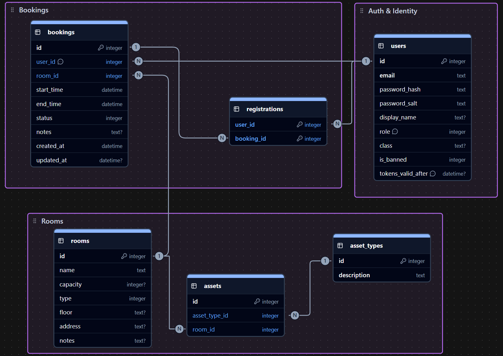

### **1. Auth & Identity**

- **One User** has **One Role Level** (Student, Teacher, or Admin).
- **One User** has **Many Refresh Tokens** (active sessions on different devices).

### **2. Rooms & Equipment**

- **One Room** contains **Many Assets** (physical items inside).
- **One Asset Type** (e.g., "Projektor") defines **Many Assets** (many copies exist in different rooms).
- _Note: An "Asset" connects a specific Room to a specific Asset Type._

### **3. Bookings & Participants**

- **One Room** hosts **Many Bookings** (scheduled at different times).
- **One User** (Host) organizes **Many Bookings**.
- **One Booking** has **Many Registrations** (a list of participants).
- **One User** holds **Many Registrations** (tickets for different events).

## **Technical Note on Dates**

**SQLite does not have a native `DATETIME` type.**

- **Storage:** Even though our schema uses `DATETIME`, SQLite actually stores these values as **TEXT** strings.
- **Format:** We strictly use the **ISO-8601** format: `"YYYY-MM-DD HH:MM:SS"`.
- **Why:** This specific string format is "lexicographically sortable" (meaning "2026..." correctly sorts after "2025...").
- **Developer Rule:** Always save dates as `DateTime.UtcNow` in C# to ensure the format remains consistent and sortable.

## SQL Schema

Ja, det behöver du! Eftersom vi helt ändrar logiken för hur inloggningen och säkerheten fungerar så behöver både din textdokumentation och din SQL-kod uppdateras.

Här är de konkreta ändringarna vi gör:

1. **Raderat:** Relationen _One-to-Many_ mellan Användare och Refresh Tokens är borta.
2. **Lagt till:** Beskrivning av den nya säkerhetsmodellen med Salt och Token Versioning.
3. **SQL:** `refresh_tokens`-tabellen är borta, och `users`-tabellen har fått de två nya kolumnerna.

Här är din kompletta och uppdaterade fil:

---

### **1. Auth & Identity**

- **One User** has **One Role Level** (Student, Teacher, or Admin).
- **Security Strategy:** - **Passwords** are manually hashed using a unique `password_salt` for each user.
- **Sessions** are stateless using JWTs. Global logout (revocation) is handled by the `tokens_valid_after` timestamp. Any JWT issued before this timestamp is considered invalid.

### **2. Rooms & Equipment**

- **One Room** contains **Many Assets** (physical items inside).
- **One Asset Type** (e.g., "Projektor") defines **Many Assets** (many copies exist in different rooms).
- _Note: An "Asset" connects a specific Room to a specific Asset Type._

### **3. Bookings & Participants**

- **One Room** hosts **Many Bookings** (scheduled at different times).
- **One User** (Host) organizes **Many Bookings**.
- **One Booking** has **Many Registrations** (a list of participants).
- **One User** holds **Many Registrations** (tickets for different events).

## **Technical Note on Dates**

**SQLite does not have a native `DATETIME` type.**

- **Storage:** Even though our schema uses `DATETIME`, SQLite actually stores these values as **TEXT** strings.
- **Format:** We strictly use the **ISO-8601** format: `"YYYY-MM-DD HH:MM:SS"`.
- **Why:** This specific string format is "lexicographically sortable" (meaning "2026..." correctly sorts after "2025...").
- **Developer Rule:** Always save dates as `DateTime.UtcNow` in C# to ensure the format remains consistent and sortable.

## SQL Schema

```sql
-- SQLite database export
PRAGMA foreign_keys = ON;

BEGIN TRANSACTION;

-- 1. Users & Auth
CREATE TABLE IF NOT EXISTS "users" (
    "id" INTEGER PRIMARY KEY AUTOINCREMENT NOT NULL,
    "email" TEXT NOT NULL UNIQUE,
    "password_hash" TEXT NOT NULL,
    "password_salt" TEXT NOT NULL, -- Added: Manual salt for password hashing
    "display_name" TEXT,
    "role" INTEGER NOT NULL, -- 0=Student, 1=Teacher, 2=Admin (example enum mapping)
    "class" TEXT,
    "is_banned" INTEGER NOT NULL DEFAULT 0,
    "tokens_valid_after" DATETIME NOT NULL DEFAULT CURRENT_TIMESTAMP -- Added: For stateless JWT revocation
);

-- REMOVED: refresh_tokens table (Replaced by tokens_valid_after in users table)

-- 2. Rooms & Equipment
CREATE TABLE IF NOT EXISTS "rooms" (
    "id" INTEGER PRIMARY KEY AUTOINCREMENT NOT NULL,
    "name" TEXT NOT NULL,
    "capacity" INTEGER,
    "type" INTEGER NOT NULL,
    "floor" TEXT,
    "address" TEXT
);

CREATE TABLE IF NOT EXISTS "asset_types" (
    "id" INTEGER PRIMARY KEY AUTOINCREMENT NOT NULL,
    "description" TEXT NOT NULL UNIQUE
);

CREATE TABLE IF NOT EXISTS "assets" (
    "id" INTEGER PRIMARY KEY AUTOINCREMENT NOT NULL,
    "asset_type_id" INTEGER NOT NULL,
    "room_id" INTEGER NOT NULL,
    FOREIGN KEY("asset_type_id") REFERENCES "asset_types"("id"),
    FOREIGN KEY("room_id") REFERENCES "rooms"("id") ON DELETE CASCADE
);

-- 3. Bookings & Participants
CREATE TABLE IF NOT EXISTS "bookings" (
    "id" INTEGER PRIMARY KEY AUTOINCREMENT NOT NULL,
    "user_id" INTEGER NOT NULL, -- The Host
    "room_id" INTEGER NOT NULL,
    "start_time" DATETIME NOT NULL,
    "end_time" DATETIME NOT NULL,
    "status" INTEGER NOT NULL,
    "notes" TEXT,
    "created_at" DATETIME NOT NULL,
    "updated_at" DATETIME,
    FOREIGN KEY("user_id") REFERENCES "users"("id"),
    FOREIGN KEY("room_id") REFERENCES "rooms"("id") ON DELETE CASCADE
);

CREATE TABLE IF NOT EXISTS "registrations" (
    "user_id" INTEGER NOT NULL,
    "booking_id" INTEGER NOT NULL,
    -- Composite Primary Key ensures a user can't register for the same booking twice
    PRIMARY KEY ("user_id", "booking_id"),
    FOREIGN KEY("booking_id") REFERENCES "bookings"("id") ON DELETE CASCADE,
    FOREIGN KEY("user_id") REFERENCES "users"("id") ON DELETE CASCADE
);

COMMIT;

```
