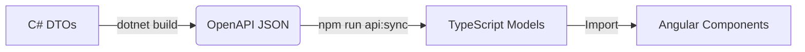

# 🚀 Developer Orchestration & Workflow Guide

## Overview

This project uses a **Monorepo-style orchestration** strategy controlled by the root `package.json`.
Instead of manually managing two terminals (Backend & Frontend) and manually updating TypeScript interfaces, we use a unified set of scripts to handle the entire lifecycle.

**Key Features:**

- **One Command Startup:** `npm start` boots everything.
- **Automated Sync:** C# DTOs are automatically converted to TypeScript interfaces on every build.
- **Unified Deployment:** Angular is compiled _into_ the ASP.NET Core backend for a single-file deployment.

---

## 🛠️ Quick Start

If you are new to the project, run these commands in the **Root Folder**:

```bash
# 1. Install all dependencies (Root, Angular, and .NET Restore)
npm run setup

# 2. Start the development environment
npm start

```

---

## 📜 Script Reference

You can always view the interactive menu by running `npm run help`.

### 1. Daily Development (`npm start`)

This is the main command. It executes a strictly ordered chain reaction:

1. **Clean:** Runs `dotnet clean` to remove stale artifacts.
2. **Build:** Runs `dotnet build`.

- _Trigger:_ This forces the `Microsoft.Extensions.ApiDescription.Server` tool to generate a fresh `Backend.json` OpenAPI spec.

3. **Sync:** Runs `frontend:sync`.

- _Trigger:_ Uses `swagger-typescript-api` to read `Backend.json` and update `src/app/api/models.ts`.

4. **Run:** Uses `concurrently` to launch:

- **Backend:** `dotnet watch` (Hot Reloads C#).
- **Frontend:** `ng serve` (Hot Reloads Angular).

### 2. Manual Sync (`npm run refresh:models`)

Use this command if you have modified a C# DTO (e.g., added a property to `UserDto`) and want the Frontend to "see" it immediately, without restarting the whole server.

### 3. Production Build (`npm run build:prod`)

This prepares the application for deployment (Azure App Service, IIS, etc.).

1. **Safety Check:** Runs `npm run setup` to ensure all packages are present.
2. **Angular Build:** Compiles the Frontend in **Production Mode** and outputs files directly into `Backend/wwwroot`.
3. **Dotnet Publish:** Compiles the Backend in **Release Mode** and bundles it with the `wwwroot` content.
4. **Output:** The final deployable application is placed in `dist/final_app`.

---

## 🏗️ Architecture & Configuration

### The "Mirroring" Pipeline

How C# code becomes TypeScript interfaces automatically:



### Key Configuration Files

| File                                    | Purpose                                                                  |
| --------------------------------------- | ------------------------------------------------------------------------ |
| **`root/package.json`**                 | The "Commander". Orchestrates calls to nested projects.                  |
| **`Backend/Backend.csproj`**            | Configured with `<OpenApiGenerateDocuments>` to dump JSON on build.      |
| **`Frontend/ng.Frontend/package.json`** | Contains the logic to generate `models.ts` via `swagger-typescript-api`. |

### Enumerations (Enums)

We have configured the Backend to serialize Enums as **Strings** (e.g., `"Admin"` instead of `0`) for better debugging and frontend readability.

- **Backend:** `JsonStringEnumConverter` is enabled in `Program.cs`.
- **Frontend:** TypeScript enums are generated with string values.

---

## 🚀 Deployment (Single Server Strategy)

This project uses a **Hosted** deployment model. We do not host the Frontend and Backend on separate servers.

1. **SPA Fallback:** The Backend is configured (`app.MapFallbackToFile("index.html")`) to serve the Angular app for any unknown URL.
2. **Static Files:** The Backend serves the compiled JS/CSS files from `wwwroot`.

### How to Deploy

1. Run `npm run build:prod` in the root.
2. Copy the contents of the **`dist/final_app`** folder to your server.
3. Run the executable (`Backend.exe` or `dotnet Backend.dll`).
4. Set `ASPNETCORE_ENVIRONMENT` to `Production` on the server.

---

## ❓ Troubleshooting

**"My frontend models aren't updating!"**

- Run `npm run refresh:models`.
- Check the build output for "API documentation generation failed". If the Backend crashes during startup (e.g., DB connection error), the JSON file will not be generated.

**"I see `UserRole = 0` instead of `UserRole = 'Admin'`"**

- Ensure `Program.cs` has `JsonStringEnumConverter` configured.
- Run `npm run refresh:models` to regenerate the TS file.

**"The startup script hangs at 'Restore'"**

- Run `npm run setup` manually once to download all heavy packages. The start script assumes packages are mostly ready.
